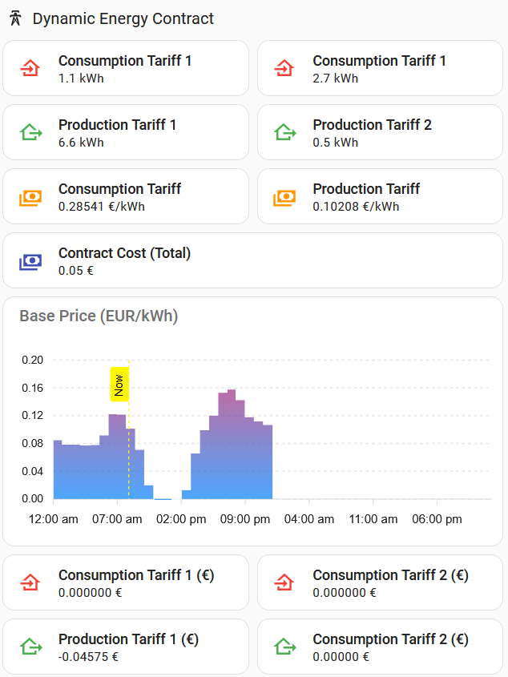

# Dynamic energy calculator
These scripts are made to cope with the Dutch dynamic energy and tariff calculations in Home Assistant. It is specifically meant for dynamic contracts.

# Installation
- Install Nordpool and configure for your region (without VAT) (... or any other energy price source)
- Point the price sensor to the energy price sensor
- Point the utility meters to the ones from your DSMR meter in the configuration.yaml
- Set all helpers to the correct value (without VAT) in the UI
- Enjoy!

# UI Card
A suggestion for a UI overview is in ui_card.yaml

